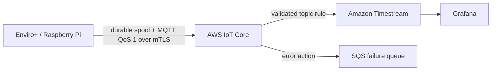

# Enviro+ Edge Telemetry Platform

A production-oriented reference implementation for collecting environmental
measurements on an embedded Linux device and routing versioned MQTT telemetry
through AWS IoT Core into Amazon Timestream.

The project is being modernised from an earlier S3/Lambda prototype. Version
0.2 focuses on a secure, observable ingestion foundation with no long-lived IAM
users or credentials provisioned by the stack.

## Architecture



Messages are published to `enviroplus/<device-id>/telemetry`. The device ID is
derived from the MQTT topic rather than trusted from the payload. The IoT rule
accepts schema version 1 and writes measurements using the device sampling
timestamp.

## Telemetry schema v1

```json
{
  "schema_version": 1,
  "temperature_c": 21.5,
  "pressure_hpa": 1012.4,
  "humidity_pct": 48.0,
  "illuminance_lux": 120.0,
  "proximity": 0.0,
  "oxidising_ohm": 100.0,
  "reducing_ohm": 200.0,
  "nh3_ohm": 300.0,
  "sampled_at_ms": 1725000000000
}
```

`TelemetryReading` validates ranges and rejects non-finite values before a
message reaches the publisher.

## Device agent

The edge agent uses the AWS IoT Device SDK v2 and an individual X.509 identity.
It first commits every reading to a local SQLite WAL, publishes it with MQTT
QoS 1, and deletes it only after the SDK acknowledges delivery. Interrupted
connections therefore produce at-least-once rather than silent data loss.
Failures are retried with bounded exponential backoff.

The CLI currently generates realistic, deterministic samples so the complete
device path can be developed without Enviro+ hardware:

```bash
poetry run enviroplus-agent \
  --endpoint <account-prefix>-ats.iot.<region>.amazonaws.com \
  --device-id lab-one \
  --certificate /secure/device.pem.crt \
  --private-key /secure/private.pem.key \
  --root-ca /secure/AmazonRootCA1.pem \
  --spool ./telemetry.db \
  --count 10 --interval 5
```

Certificate material is supplied at runtime and must never be committed. The
included hardened systemd unit shows the intended production file layout.

## Security decisions

- Devices authenticate to AWS IoT Core with individual X.509 certificates.
- Private keys are generated and retained on the device, not in CloudFormation.
- The CDK stack creates no IAM users or passwords.
- The IoT rule role can write only to the telemetry table and failure queue.
- SQS is encrypted and rejects non-TLS access.
- Failed rule actions are retained for 14 days for investigation and replay.

Device certificate provisioning is intentionally separate from this stack. A
future provisioning workflow will attach a per-device policy restricted to the
device's own MQTT topic.

## Development

Requirements: Python 3.12, Poetry, and the AWS CDK CLI.

```bash
poetry install
poetry run pytest
poetry run ruff check .
poetry run python app.py
```

Deploy to an already bootstrapped AWS account:

```bash
poetry run cdk deploy --profile <profile>
```

## Current scope and roadmap

Implemented in v0.3:

- versioned and validated telemetry model
- IoT Core topic rule
- Timestream database and retention policy
- encrypted SQS failure queue
- least-privilege service role
- CDK assertion tests and continuous integration
- mutual-TLS publisher using the AWS IoT Device SDK v2
- SQLite write-ahead spool with QoS 1 delivery and exponential backoff
- deterministic simulated-device mode for hardware-independent development

Next milestones:

- Enviro+ hardware sensor adapter
- CloudWatch operational metrics and alarms
- reproducible Grafana dashboard
- automated integration test in a disposable AWS environment

## Service availability note

Amazon Timestream for LiveAnalytics is no longer available to new customers
after 20 June 2025. Existing customers can continue using it. A future storage
adapter will provide a deployable alternative for new AWS accounts while
preserving the telemetry contract.
